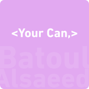

## Project Overview
This project focuses on building a webpage structure from scratch using pure HTML semantic elements only. We are implementing a layout based on a Figma design to ensure W3C compliance and proper DOM structure. This practice helps us master the core fundamentals of web development without relying on external libraries.

